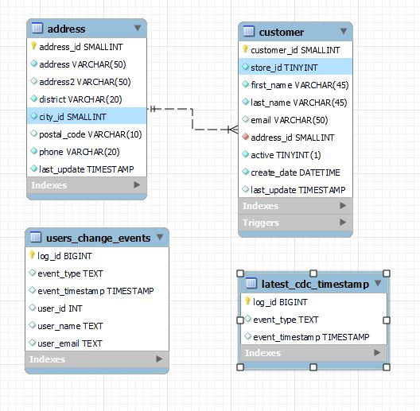
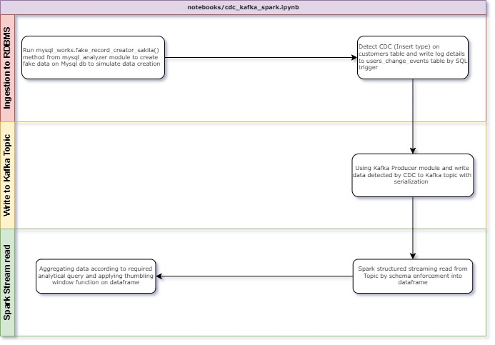
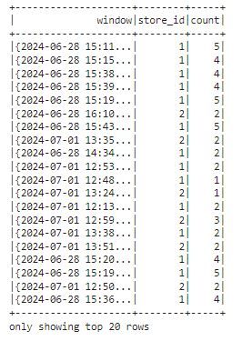

# Streaming Task Tutorial

## Scenario
Analytics department would like to see distribution of customer registration operations by store in real time. Target is to see how many customer being registered from a store in time windows of ... minutes of intervals.

To simulate solution for above requirement, In this tutorial a data flow set up to simulate CDC on a RDBMS database (MYSQL). Afterwards, Data filtered by CDC log timestamps then written into a KAFKA topic to be an available stream source for downstream systems.

Finally, stream data read by Spark Structured Streaming read methods from Kafka Topic`s related topic offset and aggregate functions applied to find result of simple analytical query required above.

With combination of 3 structure mentioned above a seamless, non-interrupted data read-write operations executed as long as new data inserted into RDBMS database.

## Schema of RDBMS source tables (MYSQL)
According to our scenario, customer data first being saved to that database.

2 tables used from sakila database of sample mysql db. Customers and address tables used. Since there is a FK constraints between 2 tables
Method designed to be able to make ingestion aligned with that fact.

Details regarding to created python method for data ingestion can be found on .py file (https://github.com/Giray18/data_analysis_tool/blob/main/src/mysql_analyzer/mysql_pandas.py) class mysql_profiler fake_record_creator_sakila method.

 

## Flow Diagram

Below flow diagram illustrates what has done over as a summary.

 

As defined on flow diagram, data ingestion is done by using a method that creates fake data by faker package and ingests into MYSQL tables. As soon as tables populated with INSERT data to customers table a TRIGGER runs to log details into a CDC TABLE (users_change_events). Every time 20 fake customer data being inserted.
Timestamp of latest log also being saved into table named as latest_cdc_timestamp to use in kafka ingestion phase for comparing latest ingestion time between users_change_events table and latest_cdc_timestamp table.

If timestamp on latest_cdc_timestamp is older than users_change_events table then Kafka producer module produce data to defined Kafka topic.

Later on data on kafka topic bein read by Spark Structured read module`s readstream method. After applying some modifications on data window functions applied to calculate count of customer registiration by store id.

Source code can be found on notebook (https://github.com/Giray18/spark_stream_job/blob/main/notebooks/cdc_kafka_spark.ipynb)

Final dataframe screenshot can be seen below 

  

As defined, to initiate data flow explained above only running notebook located on (https://github.com/Giray18/spark_stream_job/blob/main/notebooks/cdc_kafka_spark.ipynb) will be enough

## Elements of Repository
### Drawio : 
Folder holding drawings used on ReadME

### Notebooks : 
Folder holding jupyter notebooks used on development

